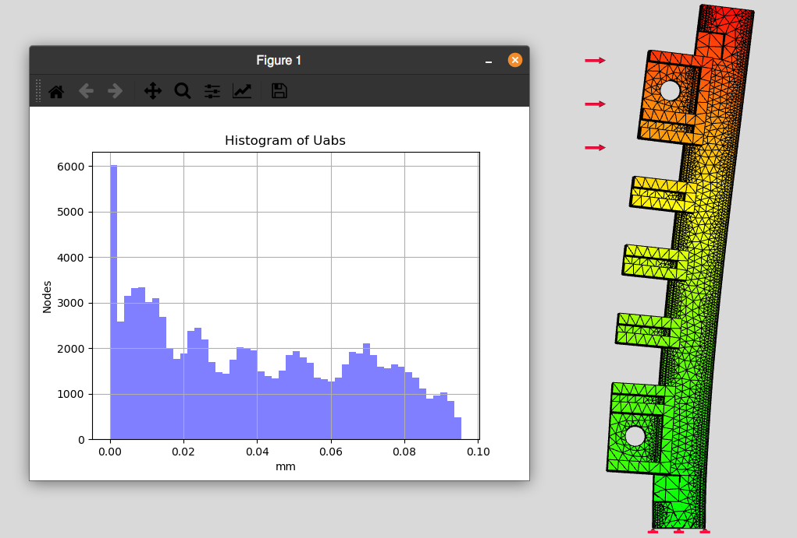

# Estrutura de Cubo
Copiando as peças do departamento de estruturas no FreeCAD pra brincar de
CAD.

## Log
É mais difícil que parece construir algo com as dimensões certas e que ainda
seja possivel montar. Fiz o suporte para as placas de acordo com as medidas
do KiCAD, mas depois notei que talvez seja um saco de montar.

Consegui fazer uma simples simulação estática FEM. Somente em uma Part, mas
eventualmente acho que dá pra fazer no cubo todo

## Screenshot
### Perspectiva

### Espaçamento para Placas

### Lateral

### Topo

### FEM

